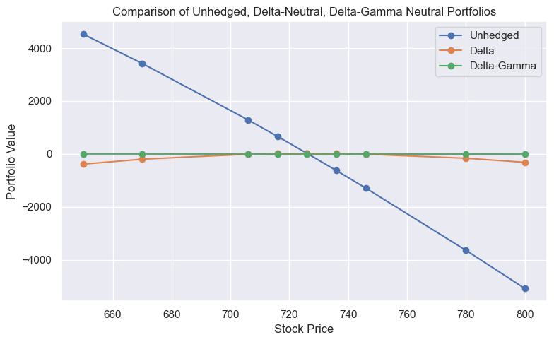

# Financial Engineering: Hedging Strategies

This repository contains a Python implementation and an R Markdown report on financial engineering techniques focusing on options hedging strategies. It explores several hedging approaches using Greek parameters to mitigate risks associated with options positions.

## Overview

The project demonstrates the use of Delta, Gamma, Vega, and other Greeks to develop hedging strategies that minimize the risk exposure of options positions. Through practical examples, including a case study with Nvidia Corporation's stock, it offers insights into Delta Hedging, Delta-Gamma Hedging, and Delta-Vega Hedging strategies.

## Repository Contents

- `financial_engeneering_hedging_strategies.py`: A Python script that implements various options hedging strategies using the Black-Scholes model. It calculates the necessary positions in the underlying asset and other options to achieve Delta neutrality, Delta-Gamma neutrality, and Delta-Vega neutrality.
- `financial_engeneering_hedging_strategies.rmd`: A detailed report that knits the output from the R markdown analysis, including theoretical background on hedging strategies, explanation of Greek parameters, and examples with real data.

## Features

- Implementation of the Black-Scholes model for options pricing.
- Calculation of Greek parameters: Delta, Gamma, Vega, Theta, and Rho.
- Strategies to achieve Delta-neutral, Delta-Gamma-neutral, and Delta-Vega-neutral portfolios.
- Example with real data demonstrating the application of these strategies.

## Getting Started

To run the Python script, ensure you have Python installed on your system along with the required libraries:
- NumPy
- Pandas
- Matplotlib
- Seaborn
- SciPy

To run the R markdown script, ensure you have installed:
- R (Version 4.3.1 or higher)
- RStudio (Recommended for ease of use)
- Specific R packages: `knitr`, `ggplot2`

## Contact
For any queries or further information, please contact [@daniel-alpizar](https://github.com/daniel-alpizar).

